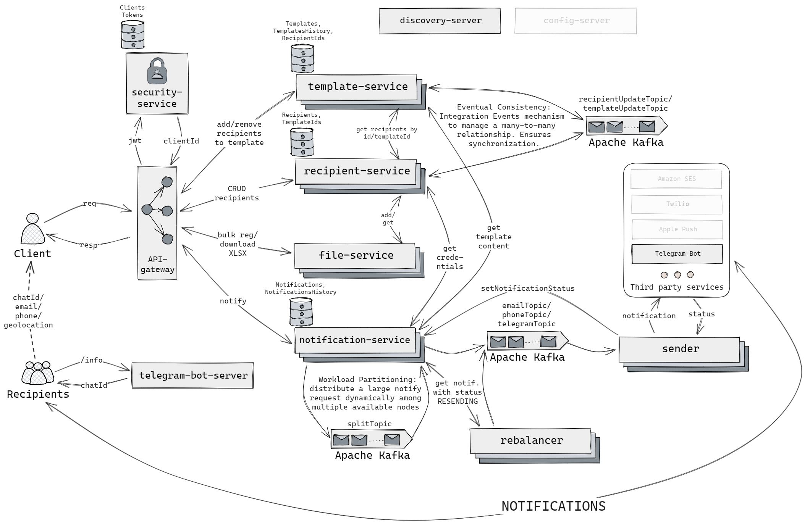

<div align="center">

# 🚨 Emergency Notification System

**Quickly and reliably notify thousands of recipients during emergencies —
via email, Telegram, and SMS — through a fault-tolerant microservices architecture.**

[](https://openjdk.org/)
[](https://spring.io/projects/spring-boot)
[](https://spring.io/projects/spring-cloud)
[](https://kafka.apache.org/)
[](https://docs.docker.com/compose/)
[](https://www.postgresql.org/)

</div>

---

## About

**Emergency Notification System** is a microservices-based platform for mass emergency
notification delivery. A client creates a message template and dispatches it to hundreds
of thousands of recipients in a single request — the system automatically distributes the
load across running instances, delivers messages asynchronously through Kafka, and
automatically retries failed deliveries.

This isn't just CRUD on top of a single database — it's 11 independent Spring Boot
services, each with its own database, connected through service discovery, an
event-driven Kafka backbone, and a single API gateway with JWT authentication.

<p align="center">
  
</p>

---

## Architecture: who does what

| Service | Role |
|---|---|
| 🧭 `discovery-server` | Registry of live service instances (Eureka) |
| 🚪 `api-gateway` | Single entry point, routing, JWT verification |
| 🔐 `security-service` | Registration, login, JWT issuing and validation |
| 📄 `template-service` | Notification templates + immutable snapshots for delivery history |
| 👥 `recipient-service` | Recipient records: email, phone, Telegram, geolocation |
| 📊 `file-service` | Bulk import/export of recipients via Excel |
| 🤖 `telegram-bot-server` | Gives a recipient their Telegram chat ID for registration |
| 📬 `notification-service` | Broadcast orchestration, notification statuses, source of truth |
| 📤 `sender` | Delivery over a specific channel (email / SMS / Telegram) |
| 🔁 `rebalancer` | Automatic retry of undelivered notifications |

---

## How the system addresses non-functional requirements

**⚡ Scalability & Low Latency**
When `notification-service` receives a request with a large recipient list, it asks
Eureka how many of its own instances are currently running, splits the list into a
matching number of chunks, and distributes them via Kafka — so parallel processing
scales automatically with the number of instances, with no manual reconfiguration.

**🛡️ Reliability**
If `sender` fails to deliver a notification, it's flagged for a retry. `rebalancer`
continuously sweeps for such stalled notifications and feeds them back into the
delivery pipeline — nothing gets silently dropped.

**🔒 Security**
Authentication happens once, at the edge: `api-gateway` validates the JWT via
`security-service` and forwards the verified client identity to every internal
service — so downstream services never need to re-validate the token themselves.

---

## Tech Stack

| Category | Stack |
|---|---|
| Language / framework | Java 17, Spring Boot 3.1, Spring Cloud 2022.0.3 |
| Messaging | Apache Kafka (Confluent Platform) |
| Service discovery | Netflix Eureka |
| API Gateway | Spring Cloud Gateway (WebFlux) |
| Data storage | PostgreSQL (one database per service) |
| Authentication | JWT |
| API documentation | springdoc-openapi + Swagger UI (aggregated through the Gateway) |
| Infrastructure | Docker / Docker Compose |
| Build | Gradle (multi-module) |

---

## Quick Start

```bash
git clone <repo-url>
cd emergency-notification-system
docker-compose up
```

Once it's up:
- Swagger UI (all services in one place): `http://localhost:8080/webjars/swagger-ui/index.html`
- Eureka Dashboard: `http://localhost:8761`

> `docker-compose.yml` pulls pre-built images from Docker Hub. To run your own code
> changes, build the images locally (`docker build`) and update the tags in the file.

---

## Feature status

- [x] Notification delivery via Telegram
- [ ] Notification delivery via email
- [ ] Notification delivery via SMS
- [ ] Push notifications
- [x] Bulk recipient registration from `.xlsx`
- [ ] Import from `.csv`
- [x] Notification templates with version history
- [ ] Geolocation-aware sending
- [ ] Recipient response handling (safety confirmation)

---

## Test Coverage

<p align="left">
  
</p>

---

<div align="center">

Built for learning purposes — as a demonstration of event-driven microservices
patterns, not as a production-ready solution.

</div>
